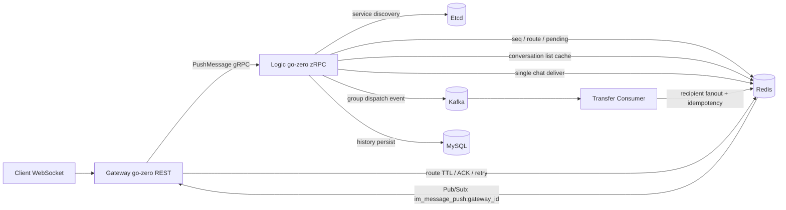

# LinkGo Chat

LinkGo Chat 由原 `LinkGo-IM` 收敛升级而来，定位为秋招主项目：**AI 好友与红包协同 IM 系统**。项目主线是 Go 后端实时通信工程能力，同时把红包并发一致性和 AI 聊天好友接入消息链路，形成 `IM + 红包 + AI` 的可演示业务闭环。

秋招目标、CodeRepair 归并方式和下一步开发清单见 [docs/AUTUMN_RECRUIT_TARGET.md](docs/AUTUMN_RECRUIT_TARGET.md)。
当前 V0 代码地图和面试材料见 [docs/CODE_MAP.md](docs/CODE_MAP.md)、[docs/CORE_LINKS.md](docs/CORE_LINKS.md)、[docs/MODULE_CARDS.md](docs/MODULE_CARDS.md)、[docs/TEST_EVIDENCE.md](docs/TEST_EVIDENCE.md)、[docs/INTERVIEW_QA.md](docs/INTERVIEW_QA.md)。

本项目是一个基于 `Go + Go-Zero` 的分布式即时通讯系统，当前版本已经补齐到更接近简历描述的工程形态：`go-zero REST + zRPC` 脚手架、`WebSocket + gRPC` 分层、`Etcd` 服务发现、`Redis` 在线状态中心、`Lua` 会话序列号、`Kafka` 群聊异步分发、`Protobuf` 二进制消息协议、`JWT + 令牌桶限流`、`MySQL` 历史消息持久化、红包事务模型和 AI 助手审计链路。

说明：
当前项目已经把 `gateway` 和 `logic` 迁移到 `go-zero` 官方脚手架结构：`gateway` 采用 REST 的 `config / handler / logic / svc / types` 分层，`logic` 采用 zRPC 的 `config / server / logic / svc` 分层；`transfer` 保持独立 Kafka 消费进程，负责异步扩散与重试死信。

## 项目亮点

- Gateway 和 Logic 解耦，接入层专注长连接，逻辑层专注消息编排。
- Gateway 使用 go-zero REST scaffold，Logic 使用 go-zero zRPC scaffold，简历里的 go-zero 表述可以落地。
- Logic 实例注册到 Etcd，Gateway 基于服务发现和 Rendezvous Hash 选择目标节点。
- WebSocket 消息载荷改为 Protobuf 二进制帧，不再依赖业务 JSON 文本。
- Redis `route:<uid>` 维护在线状态，结合网关定向 `Pub/Sub` 完成跨节点实时推送。
- Redis Lua 脚本为每个会话分配单调递增 `seq`，用于会话内排序、去重和补偿。
- `client_msg_id + message_id` 做上下行幂等，重复发送不会重复分配 `seq` 或重复群扩散。
- 红包第一版支持发红包、抢红包和详情查询，使用 MySQL 事务 + 行锁 + 唯一索引防止超卖和重复领取，金额统一按“分”存储。
- AI 助手当前支持群聊总结、待办提取、风险提取和企业知识库问答，先用 mock provider 跑通权限校验、文档召回、结果落库、指标和演示脚本。
- `pending_ack + ack_idx + ack_retry` 维护待确认消息，ACK 超时后 Gateway 有限重试，弱网断线后支持重放未 ACK 消息。
- 登录后自动返回最近会话列表：Redis `user:conversations:<uid>` 用 ZSET 按最近消息时间排序，`conversation:last:<cid>` 保存最后一条消息摘要，`user:conversation:read:<uid>` 保存用户会话进度并计算未读数。
- `session_timeline:<session_id>` 按会话维护 `seq -> message_id` 时间线，单聊和群聊重连都可按 `last_seq` 补齐，群聊不再为每个成员重复写会话消息索引。
- Gateway 维护 `gateway_users:<gatewayId>` / `gateway_conn:<gatewayId>:<connId>` 反向索引，结合 TTL 心跳和启动清理处理网关宕机残留路由。
- 群聊消息先写入 Kafka，由 `transfer` 服务异步消费扩散，降低 Logic 同步扇出压力。
- `transfer` 按 `message_id + recipient` 做消费幂等，对 Kafka 消费失败链路做重试和死信处理，避免异步链路静默丢消息。
- 网关集成 JWT 鉴权与分片令牌桶限流，避免恶意握手和暴力登录，并降低高并发下单把锁竞争。
- 系统暴露 Prometheus `/metrics` 指标，可观测连接数、消息吞吐、ACK、Kafka 重试、红包操作等状态。
- Gateway 和 Transfer 增加 `/healthz`、`/readyz` 健康检查接口，便于本地调试、Docker Compose 健康检测和后续接入监控。
- 内部异常日志统一收敛到 go-zero `logx`，方便按错误链路排查 Redis、WebSocket、ACK、Kafka 消费等问题。

## 设计边界

- Gateway 管连接：负责登录入口、JWT 校验、WebSocket 长连接、心跳保活、ACK 接收和离线消息回放，不承载复杂消息编排。
- Logic 管路由和会话：负责消息校验、`session_id / seq / message_id` 生成、在线状态查询、单聊分发和历史查询，不持有 WebSocket 连接。
- Transfer 管群聊扩散：基于 Kafka 消费群聊任务，按群成员异步扩散，失败任务进入 retry / dead-letter 链路。
- Redis 管在线态和补偿：保存 `route:<uid>`、`pending_ack`、`ack_idx`、`offline_msg`、`message_payload`、`session_timeline`、`user:conversations`、`conversation:last`、`conversation:members` 和群成员缓存，不作为最终历史消息存储。
- MySQL 管最终历史：消息最终落 MySQL，历史消息按 `session_id + seq` 查询，会话列表按 `conversations / conversation_members` 回源。
- 红包边界：当前实现普通等额红包，解决超卖和重复领取；暂不做钱包扣款、余额入账和资金流水，这部分应作为独立资金域继续升级。
- AI 边界：当前已经支持 `mock / openai-compatible / fallback` provider、群聊总结和最小 FAQ/RAG 问答；更复杂的向量索引、token/cost 控制和完整 DLP 仍放在后续版本。
- Pub/Sub 只做在线实时通知：不把 Redis Pub/Sub 当可靠队列，可靠性依赖 pending、ACK、离线回放和历史补齐。
- ACK 边界：当前实现的是接收方收到消息后的投递 ACK，不是已读 ACK；服务端写 WebSocket 成功不会立即清理 pending，收到客户端 ACK 后才清理。
- 顺序性边界：只保证单会话维度递增 `seq`，不做全局消息顺序。

## 架构分层

- `gateway`
  - 处理登录接口、JWT 校验、WebSocket 握手、心跳、ACK、离线消息回放
  - 从 Etcd 发现 Logic 节点，并按用户维度做一致性路由
- `logic`
  - 校验消息、补全 `session_id / seq / message_id / sent_at`
  - 单聊直接投递，群聊写入 Kafka 进行异步扩散
  - 持久化 MySQL，提供历史消息查询
- `transfer`
  - 消费 Kafka 群聊任务
  - 把群聊消息再投递到 Redis 在线链路和 ACK/离线链路
  - 失败任务重试，超过阈值进入死信主题
- `redis`
  - 在线路由、Gateway 反向索引、Pub/Sub、未确认消息、会话 timeline、会话列表热索引、离线补偿、群组成员缓存
- `mysql`
  - 用户信息、消息历史、会话元信息、会话成员关系、红包记录和 AI 总结记录
- `ai`
  - 读取群聊上下文，生成总结/待办/风险，保存审计记录
- `etcd`
  - Logic 服务注册与发现
- `kafka`
  - 群聊削峰填谷

## 架构图



## 核心链路

1. 用户调用 `/api/v1/login`，Logic 校验账号密码后签发 JWT，并按 `user:conversations:<uid>` 拉取最近 50 个会话；Redis 未命中时回源 MySQL `conversation_members + conversations`，返回 `conversation_id / type / title / last_msg / last_seq / read_seq / unread_count / updated_at`。
2. 客户端通过 `/ws?token=...` 建立 WebSocket。
3. Gateway 校验 JWT 后写入 `route:<uid> = gatewayId|connId`，同时维护 `gateway_users:<gatewayId>` 与 `gateway_conn:<gatewayId>:<connId>` 反向索引。
4. Gateway 按 `pending_ack:<uid>` 回放未 ACK 消息；如果重连 URL 携带 `session_id` 和 `last_seq`，再从 `session_timeline:<session_id>` 补齐 `seq > last_seq` 的消息。
5. 客户端发送 Protobuf `WireMessage` 二进制帧到 Gateway，普通消息必须携带 `client_msg_id`；Gateway 补齐 `trace_id` 后经 Etcd 发现 Logic 节点并 gRPC 转发。
6. Logic 先用 `client_msg:<uid>:<client_msg_id>` 做发送幂等，再用 MySQL `uk_sender_client_msg` 做最终兜底，然后用 Lua 分配会话 `seq`，同步落库并补齐 `message_id / session_id / sent_at`。
7. 单聊消息直接进入 RedisDelivery；群聊消息写入 Kafka，由 `transfer` 异步消费扩散。
8. Logic/Transfer 按消息维度写 `message_payload:<message_id>` 和 `session_timeline:<session_id>`；RedisDelivery 再按接收人写入 `pending_ack / ack_idx / ack_retry`，在线用户定向 Pub/Sub，离线、无订阅者或推送失败时写入 `offline_msg`。
9. Logic 同步更新会话热索引：`user:conversations:<uid>` 只存会话 ID，`conversation:last:<cid>` 存最后一条消息摘要，`conversation:members:<cid>` 存成员；MySQL 异步 upsert `conversations / conversation_members`。
10. 客户端收到消息后回传 ACK，Gateway 删除 `pending_ack / offline_msg / ack_idx / ack_retry`，并推进 Redis `user:conversation:read:<uid>` 中该会话的已收到 seq；ACK 超时则本机 Gateway 按在线反向索引有限重试。这里的 read_seq 表示客户端已确认收到的进度，不等同于完整“已读回执”。
11. Transfer 按 `group_delivery:<message_id>:<recipient>` 做收件人级幂等；投递失败进入 retry topic，多次失败后进入 dead-letter topic。
12. 关键日志均带 `trace_id / message_id / seq / gateway_id`，Gateway / Transfer 暴露 Prometheus 指标。
13. Logic 同步落库 MySQL 后再进入投递链路，历史消息按 `session_id + seq` 查询。

## 协议说明

WebSocket 和 gRPC 上行消息共用 `api.WireMessage`：

```proto
message WireMessage {
  string message_id = 1;
  string session_id = 2;
  int64 seq = 3;
  string from = 4;
  string to = 5;
  string to_type = 6;
  MsgType msg_type = 7;
  string body = 8;
  int64 sent_at = 9;
  string ack_message_id = 10;
  string client_msg_id = 11;
  string trace_id = 12;
  int64 last_seq = 13;
}
```

其中：

- 普通消息使用 `msg_type = NORMAL`
- 心跳使用 `msg_type = HEARTBEAT`
- ACK 使用 `msg_type = ACK`
- `client_msg_id` 是客户端生成的发送幂等键；服务端生成的最终消息 ID 是 `message_id`，会话内递增序号是 `seq`
- `last_seq` 用于重连或心跳补偿，客户端可通过 `/ws?session_id=...&last_seq=...` 触发补齐

## 目录结构

```text
.
├── api/                # protobuf 协议和 gRPC 生成代码
├── benchmark/          # 压测脚本和报告
├── cmd/                # gateway / logic / transfer 入口
├── deploy/k8s/         # Kubernetes 部署清单
├── docs/               # 简历、面试、教学材料
├── internal/           # 业务核心实现
├── pkg/                # 通用工具
├── public/             # 调试页面
├── sql/                # 初始化 SQL
├── docker-compose.yml
└── docker-compose.10node.yml
```

所有目录都已经补了独立 README。

## 快速启动

```bash
docker-compose up --build
```

常用开发命令：

```bash
make test        # 运行全部 Go 单元测试
make build       # 构建 gateway / logic / transfer 三个二进制
make docker-build # 构建本地 Docker 镜像
make docker-up   # 使用 Docker Compose 启动完整本地环境
make docker-down # 停止本地容器环境
make ci-local    # 本地模拟 CI：测试、构建、Compose 配置检查、镜像构建
make core-im-demo # 运行登录、WebSocket、单聊、ACK、离线补偿演示；完整群聊扩散需全量栈
make ai-demo      # 运行 AI 群聊总结演示；默认使用 docker-compose.light.yml
make ai-ask-demo  # 运行 AI FAQ/知识库问答演示；默认使用 docker-compose.light.yml
make im-ai-final-demo # 统一运行 core IM + AI summary + AI ask 的标准演示流程
```

Docker / Kubernetes / CI-CD 的详细用法见 [docs/devops-guide.md](docs/devops-guide.md)。

如果本地已经用旧版 SQL 初始化过 MySQL，需要按需执行 `sql/20260518_conversations.sql`、`sql/20260611_v1_message_idempotency.sql`、`sql/20260611_contacts_groups.sql`、`sql/20260703_red_packets.sql` 和 `sql/20260705_ai_summary.sql`；全新环境直接使用 `sql/init.sql` 即可。

默认组件：

- Gateway A: `http://127.0.0.1:8090`
- Gateway B: `http://127.0.0.1:8091`
- Gateway C: `http://127.0.0.1:8092`
- Etcd: `127.0.0.1:2379`
- Kafka: `127.0.0.1:9092`
- Redis: `127.0.0.1:6379`
- MySQL: `127.0.0.1:3306`
- Transfer Metrics: `127.0.0.1:9102/metrics`

测试账号：

- `userA / 123456` -> `1001`
- `userB / 123456` -> `1002`
- `userC / 123456` -> `1003`

## 故障场景

- 客户端重复发送：客户端重试同一条消息时复用 `client_msg_id`，Logic 命中 Redis 幂等记录或 MySQL `uk_sender_client_msg` 后直接返回，不再生成新的 `seq/message_id`。
- ACK 丢失或弱网：RedisDelivery 已写入 `pending_ack` 和 `ack_idx`，Gateway 后台扫描本节点在线用户，超过 `ACK_TIMEOUT_SECONDS` 未确认则重推，最多 `ACK_MAX_RETRIES` 次。
- 客户端断线重连：Gateway 握手成功后先回放 `pending_ack`；如果客户端提供 `session_id + last_seq`，再从 `session_timeline:<session_id>` 补齐缺失 `seq`。
- 大群离线补偿：群消息本体 MySQL 只存一行，Redis 热缓存 `message_payload:<message_id>` 只写一份，会话索引 `session_timeline:<session_id>` 也只写一份；用户侧只保留 `pending_ack/offline_msg` 的 `message_id` 指针，避免按群成员复制完整消息内容。
- Gateway 宕机：`route:<uid>` 与 `gateway_users:<gatewayId>` 都带 TTL；同 ID Gateway 重启时会清理自己的旧 route 和连接反向索引，Redis Pub/Sub 无订阅者时也会清掉 stale route 并转离线。
- 群聊 Transfer 重复消费：Transfer 使用 `group_delivery:<message_id>:<recipient>` 做收件人级幂等，Kafka rebalance 或 retry 不会重复投递已成功收件人。
- 群聊扩散失败：单个收件人投递失败后任务写入 retry topic；超过 `KAFKA_MAX_ATTEMPTS` 后写入 `group_message_dlq`，日志保留 `trace_id/message_id/seq`。
- 红包并发抢：抢红包时先查领取唯一索引，再在事务里 `SELECT ... FOR UPDATE` 锁定红包主行，按剩余份数扣减，`red_packet_claims(red_packet_id,user_id)` 唯一索引兜底重复领取，避免超卖。

## 压测说明

压测脚本位于 `benchmark/`：

```bash
docker-compose -f docker-compose.10node.yml up --build
bash benchmark/run_bench_10node.sh
```

建议记录这些指标，填入 `benchmark/bench_report.md` 后再写进简历：10 Gateway 数量、WebSocket 长连接数、心跳周期与成功率、单聊平均投递延迟、P99 延迟、ACK 超时率、Kafka retry/DLQ 数、Gateway CPU 峰值和内存峰值。当前 README 不硬写未复测的延迟数字，避免实现和量化结果脱节。

## 当前和简历要求的对应关系

已完成：

- gRPC + Etcd 服务发现
- Redis 在线状态中心 + 跨节点精准路由
- Protobuf 二进制消息协议
- Lua 会话 Sequence ID
- message_id / client_msg_id 幂等
- ACK pending、超时重试与基于 session_timeline 的 last_seq 重连补偿
- Gateway TTL 心跳、反向索引与宕机清理
- Redis ZSET 会话列表、MySQL 会话元信息和登录自动拉取最近会话
- Kafka 群聊异步扩散
- Kafka 群扩散消费幂等、重试与死信
- trace_id / message_id / seq / gateway_id 结构化日志
- JWT 鉴权
- 令牌桶限流
- 双向心跳
- Prometheus 指标暴露
- Docker Compose 本地容器化联调
- Kubernetes Deployment / Service / Probe 清单
- GitHub Actions CI：自动测试、构建服务、构建 Docker 镜像、检查 K8s 清单
- Gateway / Transfer 健康检查
- 红包发放、领取、详情查询的后端闭环与调试台入口
- 基础单元测试与统一日志

仍可继续增强：

- Etcd watch 本地缓存，减少每次发现都查询 Etcd 的开销
- 按会话维度持久化客户端 last_seq，减少客户端重连参数依赖
- 将 `ack_idx:<uid>` 里的 payload 副本进一步优化成纯 `message_id` 指针，重推时优先读 `message_payload`，未命中再查 MySQL
- 红包继续升级为资金域：账户余额、冻结/扣减、资金流水、退款任务、审计对账

## 可直接写进简历的版本

基于 Go + go-zero 构建即时通讯后端项目，采用 Gateway + Logic + Transfer 分层架构，围绕多 Gateway 场景下的连接管理、跨节点消息路由、会话级顺序控制、`client_msg_id/message_id` 幂等、接收方 ACK 超时重试、`last_seq` 重连补偿、登录会话列表与群聊异步扩散进行设计；使用 Redis 维护在线路由、Gateway 反向索引、pending、离线补偿、`session_timeline` 会话时间线和 `user:conversations` ZSET 会话热索引，使用 Kafka 解耦群聊扩散链路并支持消费幂等、retry 和 DLQ，使用 MySQL 存储最终历史消息、会话元信息和会话成员关系；基于 Docker Compose 编排完整本地环境，补充健康检查、基础单元测试和结构化日志，提升本地调试与项目可维护性。
