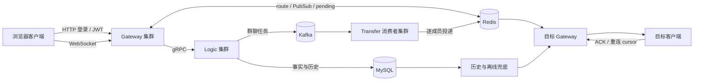

# LinkGo IM 项目 30 分钟面试讲稿

这份稿子只讲 LinkGo IM，不包含 CodeRepair 或其他 AI 项目。目标是让你能在 30 到 40 分钟内完整讲一遍项目，并能接住面试官继续追问。

讲稿使用当前仓库事实。可以讲清楚的实现写成“当前实现”，只在明确标为“生产演进”时谈未来方案。不要把本地 Compose、Kubernetes 清单或单实例中间件演练说成真实公司生产集群。

## 一、先背这张思维导图

```text
LinkGo IM
├── 1. 要解决的问题
│   ├── HTTP 登录和业务接口
│   ├── WebSocket 实时收发
│   ├── 多 Gateway 下的跨节点单聊
│   ├── 离线、ACK、重连和重复消息
│   └── 群聊 fan-out 不能阻塞 Gateway
│
├── 2. 入口层 Gateway
│   ├── REST：登录、历史、好友、群、红包、AI
│   ├── WebSocket：连接、心跳、上行消息、ACK
│   ├── JWT、Origin、限流、资源权限
│   ├── 本机连接表 + Redis route
│   └── uid 分片有界队列和背压
│
├── 3. 业务层 Logic
│   ├── MySQL：用户、关系、消息、会话、红包、AI 记录
│   ├── Redis：seq、pending、timeline、route、Pub/Sub
│   ├── 单聊：消息事务 → pending → 定向 Gateway
│   └── 群聊：解析成员 → Kafka job
│
├── 4. 异步投递 Transfer
│   ├── Kafka FetchMessage
│   ├── 成员 lease 和幂等
│   ├── Redis 投递
│   ├── retry / DLQ
│   └── 成功或转移后 CommitMessages
│
├── 5. 可靠性
│   ├── client_msg_id 幂等
│   ├── session seq 单调分配
│   ├── ACK 只推进 acked_seq
│   ├── read_seq 与 acked_seq 分开
│   ├── 离线 pending 回放
│   └── 故障 readyz 摘流量、替换、业务 smoke
│
├── 6. 运维和测试
│   ├── healthz / readyz / metrics
│   ├── Docker Compose 多服务复现
│   ├── K8s Deployment、PDB、HPA、滚动发布
│   ├── Go test、vet、race、构建
│   └── Redis、Logic、Kafka、Transfer、MySQL、Gateway 故障演练
│
└── 7. 当前边界
    ├── 浏览器客户端是原生调试页
    ├── route 仍是单值，不是完整多设备模型
    ├── Redis/MySQL/Kafka HA 依赖外部平台
    ├── 群消息仍需同步解析 recipients
    └── 红包不是资金系统，AI 默认 mock
```

如果面试官喜欢看图，可以把下面这张图作为白板版本。先画四个服务，再补两条状态路径，最后补故障恢复，不要一开始把所有组件都画上去。



## 二、开场版本：90 秒

面试官问“介绍一下你的项目”时，先说这一段，不要一上来背所有中间件：

> 我做的是一个 Go 语言的实时 IM 系统 LinkGo。它的重点不是普通的聊天页面，而是多 Gateway 部署下，用户连接在哪台机器都能完成消息投递，并且要处理离线、ACK、重连、重复消息和服务故障。
>
> 系统入口是 Gateway，负责 HTTP、WebSocket、JWT、Origin 校验、限流、本机连接管理和结果帧。核心业务由 Logic 通过 gRPC 处理。MySQL 保存用户、好友、群成员、消息历史、会话关系和业务记录；Redis 保存在线路由、消息序号、pending ACK、短期 timeline 和跨 Gateway 通知。单聊先由 Logic 做权限、幂等、序号和消息落库，再把消息写入接收方的 pending 状态，通过 Redis 定向通知目标 Gateway。群聊不在 Gateway 里同步遍历所有成员，而是把带 recipients 快照的任务写入 Kafka，由 Transfer 独立消费、逐成员投递，失败时进入 retry 或 DLQ，处理结果可靠保存后才提交 Kafka offset。
>
> 我还补了故障先行的处理。Gateway、Logic、Transfer 都有 liveness 和 readiness，Logic 的 gRPC Health Check 会检查 Redis、MySQL、Kafka。故障时先摘掉不能接收新流量的实例，再由 Kubernetes 或 Compose 重启替换，最后重新跑登录、单聊、ACK、离线回放和群聊 smoke。当前仓库已经在完整 Compose 上演练过 Redis、MySQL、Logic、Kafka、Transfer 故障和 Gateway 替换，但 Redis Cluster、MySQL 主从和 Kafka 多副本 HA 仍由生产平台提供，不是应用内部实现。

说完停一下。面试官通常会从“为什么这样拆”“跨服务器消息怎么走”“如何保证不丢”三个方向继续问。

## 三、第一部分：项目为什么这样设计，约 3 分钟

### 3.1 先讲实际问题

不要说“我用了 Redis、Kafka、Kubernetes，所以很高级”。先说问题：

```text
用户 A 和 B 可能连接到不同 Gateway
Gateway 进程内存只能找到本机连接
单聊需要跨节点定位目标用户
群聊一次要投递很多成员
网络会断，客户端会重复发送或收不到 ACK
服务实例会重启，不能只依赖进程内存
```

因此系统有两条主线：

```text
实时路径：WebSocket、Redis route、Pub/Sub、ACK
事实路径：MySQL 消息、关系、会话和 Kafka 未提交任务
```

这里要明确：Redis Pub/Sub 是实时通知，不是可靠消息存储。消息可靠性来自 MySQL、pending、ACK、重试和 Kafka offset 的组合。

### 3.2 为什么拆成 Gateway、Logic、Transfer

Gateway 适合处理连接，不适合承担大量业务和群成员循环。Logic 适合处理鉴权、事务、消息状态和业务规则。Transfer 适合消费 Kafka 任务并做群成员投递。

拆分的直接收益：

1. Gateway 可以横向扩容，新连接可以进入新实例，旧 WebSocket 不需要迁移。
2. Logic 可以独立做 gRPC 负载均衡和业务扩容。
3. 群聊 fan-out 与用户连接处理解耦，慢成员不会卡住 Gateway 的读循环。
4. Transfer 可以按 Kafka consumer group 扩容。

代价也要主动说：服务之间有网络故障，Redis、MySQL、Kafka 和 Etcd 都成为需要监控的外部依赖；消息可能重复，必须做幂等；排查要靠 trace_id、message_id 和 metrics 串起来。

## 四、第二部分：客户端、HTTP 登录和 JWT，约 3 分钟

### 4.1 当前客户端是什么

当前 `public/index.html` 是原生 HTML、CSS 和 JavaScript 的浏览器调试客户端，不是 React 或 Vue 商业前端。它可以登录、查看好友和群、建立 WebSocket、发送单聊和群聊、接收 ACK、离线重连、查历史、发红包和调用 AI。

客户端只负责：

```text
收集账号密码
保存登录返回的 token
给 HTTP 请求加 Authorization
给 WebSocket URL 加 token
维护页面内的会话游标
收到消息后发送 ACK
断线后指数退避重连
```

客户端不负责生成 JWT，也不保存 JWT Secret。

### 4.2 登录完整时序

```text
Browser
  POST /api/v1/login {username,password}
      ↓
Gateway LoginHandler
      ↓ gRPC
Logic.Login
      ↓
MySQL 查询 users
      ↓
bcrypt 校验密码
      ↓
GenerateToken(user_id)
      ↓
返回 token、user_id、conversations
```

Logic 使用 HS256 签名，JWT 中包含 `user_id`、`iat` 和 `exp`。当前过期时间是 24 小时。Gateway 的登录路由不要求 JWT，因为登录本来就是拿 Token 的入口，但它仍然使用基于 IP 的令牌桶限流。

### 4.3 为什么不同接口使用不同中间件

登录路由：

```text
RateLimitMiddleware → LoginHandler
```

普通业务路由：

```text
AuthMiddleware → RateLimitMiddleware → BusinessHandler
```

`next` 就是当前中间件后面要执行的 Handler。go-zero 的 `WithMiddlewares` 会把 `Route.Handler` 传给中间件：

```go
wrapped := middleware(route.Handler)
```

JWT 解析成功后，AuthMiddleware 把用户 ID 放到 `context.Context`，后面的业务逻辑从 Context 读取身份，不相信客户端自己传的 user_id。

WebSocket 没有自定义 Authorization Header，当前浏览器客户端使用：

```text
/ws?token=<JWT>
```

Gateway 同时校验 JWT 和 Origin。Origin 解决恶意网页借浏览器发起连接的问题，JWT 解决身份问题，两者不能互相替代。

## 五、第三部分：跨 Gateway 单聊，约 6 分钟

这是项目最重要的一条链路，建议用固定例子：A 在 Gateway-1，B 在 Gateway-3。

### 5.1 建连阶段

```text
B 浏览器
  ↓ WebSocket
Gateway-3
  ├── 校验 JWT
  ├── 校验 Origin
  ├── 检查 session_id 对应的会话权限
  ├── 创建本机 ClientConn
  ├── 放入 ClientManager 的本机 map
  └── Redis route:B = gateway-3，设置 TTL
```

本机 map 只能解决 Gateway-3 找到 B 的连接。Gateway-1 的内存里没有 B，所以跨节点必须查共享 Redis route。

Heartbeat 会刷新 route TTL。Gateway 退出时尝试清理自己持有的 route；如果进程突然断电，TTL 最终会让旧 route 失效。清理和刷新都带 owner 校验，避免旧 Gateway 删除新 Gateway 的路由。

### 5.2 A 发送单聊

```text
A WebSocket
  ↓ 二进制 WireMessage
Gateway-1 ClientConn
  ├── 读取帧、解析 protobuf
  ├── 放入按 uid 分片的有界 push/业务队列
  └── gRPC PushMessage
          ↓
Logic
  ├── 校验 A 与 B 的好友关系
  ├── 检查 client_msg_id 幂等
  ├── 生成 session_id 和 seq
  ├── MySQL 事务写 messages
  ├── 写 conversation 摘要 outbox
  ├── Redis 写 B 的 pending_ack
  └── 查询 B 的 route 并定向发布
          ↓
Redis Pub/Sub channel for gateway-3
          ↓
Gateway-3
  ├── 收到通知
  ├── 查本机 ClientManager 找 B
  ├── 写 WebSocket
  └── B 收到 message_id、session_id、seq
```

### 5.3 为什么必须先写 pending 再 Pub/Sub

如果顺序是：

```text
先 PUBLISH
再写 pending
```

Gateway-3 可能立即推送，B 也可能立即 ACK。此时 pending 还没有建立，ACK 清理不到记录，后续又可能把消息当成未确认消息重发。

当前顺序是：

```text
pending 预占
→ 发布实时通知
→ 客户端收到
→ 客户端 ACK
→ 原子清理 pending、offline、ack index 和 retry index
```

Redis Pub/Sub 本身没有持久化和消费确认，所以它只负责“叫醒目标 Gateway”。如果目标不在线或通知丢失，pending 和离线回放负责补偿。

### 5.4 ACK 到底确认什么

B 收到消息后返回 ACK，ACK 中带 `ack_message_id`。Gateway 根据 message_id 找回消息，执行 Lua 脚本原子清理相关 Redis 索引，并尝试把：

```sql
conversation_members.acked_seq
```

单调推进到当前 seq。

ACK 表示客户端可靠收到，不表示用户已经阅读。阅读位置是另一个概念 `read_seq`，当前项目没有把 ACK 冒充成完整的多端已读系统。

### 5.5 如果 Gateway-1 和 Gateway-3 在不同服务器

只要它们连接同一个 Redis、MySQL 和服务发现系统，链路不依赖本机内存共享：

```text
Gateway-1 本机连接 A
Gateway-3 本机连接 B
Logic 访问共享 MySQL/Redis
Redis route 定位 Gateway-3
Redis channel 通知 Gateway-3
Gateway-3 访问本机 map 找 B
```

生产环境中 Redis、MySQL、Kafka、Etcd 应该由独立集群或托管服务提供稳定入口。当前仓库只验证单机 Compose 和多 Gateway 逻辑，不实现这些中间件的集群选主。

## 六、第四部分：消息序号、幂等、顺序和背压，约 5 分钟

### 6.1 `client_msg_id` 和 `message_id`

两者不能混淆：

```text
client_msg_id：客户端一次发送意图的 ID，重试时保持不变
message_id：服务端接受后生成的稳定消息 ID
```

如果客户端发送后没有收到结果，它应该使用同一个 `client_msg_id` 重试。Logic 查询幂等记录，如果这次请求已经成功处理，就返回原来的 message_id，不重复插入消息。

### 6.2 `seq` 为什么用 Redis Lua

同一个会话的消息需要递增序号，但多个 Logic 实例可能同时处理消息。普通的：

```text
GET last_seq
加一
SET last_seq
```

不是原子的，两个请求可能读到同一个旧值。

Lua 脚本在 Redis 内部一次执行：

```text
读取当前 last_seq
加一
写回新值
返回新 seq
```

这样可以保证序号分配不会因为多个 Logic 实例并发而重复。需要注意，Redis 先分配 seq、之后 MySQL 写入失败时可能产生空洞。因此项目承诺 seq 单调分配，不承诺所有整数都一定对应已提交消息。历史和补偿查询真实存在的消息，不能等待缺失的 seq。

### 6.3 同一用户为什么要按 uid 分片

Gateway 不能让一个全局 worker 随便并发处理同一用户的消息，否则同一个用户的消息可能乱序写出。当前 push pool 使用：

```text
hash(uid) % shardCount
```

同一个 uid 固定进入同一 shard，shard 内 FIFO；不同 uid 可以并行。队列有上限，队列满时返回明确的服务器繁忙结果和原 `client_msg_id`，客户端之后可以重试。

这解决的是 Gateway 进程内的入口顺序和背压，不等于跨多个 Logic 实例的全局事务顺序。跨节点最终顺序仍由 session seq、数据库真实记录和客户端游标处理。

### 6.4 ACK 超时怎么办

如果消息已经发给 B，但 B 的 ACK 丢了，Gateway 的 pending retry worker 会在有限次数内重发。重发可能导致 B 收到重复消息，所以客户端要按 message_id 去重，服务端投递状态也要幂等。

这是一种 at-least-once 设计：尽量不漏发，但允许重复。项目没有声称 exactly-once，因为网络和进程故障下很难同时保证不丢、不重和低延迟。

## 七、第五部分：离线和重连，约 4 分钟

### 7.1 B 离线时发生什么

```text
Logic 写 MySQL 消息
→ Redis 写 pending_ack:B
→ 没有有效 route，写 offline_msg:B 标记
→ 发送结果仍然不能伪装成 B 已读
```

消息正文的长期事实在 MySQL，Redis pending 是快速恢复索引。当前 `offline_msg` 主要是离线标记，重连实际先读取 pending 相关数据。

### 7.2 B 重连时怎么补

```text
B 重新登录并建立 WebSocket
→ 携带 session_id 和 last_seq
→ 先回放 pending ACK 消息
→ 再从 Redis timeline 补近期 seq 缺口
→ Redis 不足时按 seq > last_seq 从 MySQL 分批读取
→ B 收到后 ACK
```

当前网页把登录返回的会话 `last_seq` 放入页面内存，再用 ACK 游标更新。刷新页面会丢失这份内存状态，所以当前客户端更接近演示版近期补偿，不是完整商业级多设备同步。

### 7.3 为什么不能重连时扫描 MySQL 全部会话

用户会话数和消息数可能很大，登录时扫描所有会话会放大数据库压力。当前项目先用 Redis 热数据和指定会话 cursor 补偿，历史 HTTP 接口使用 `before_seq` 分页。

生产演进可以增加持久化设备游标、会话同步接口和分批任务，但不能把它说成当前已经实现。

## 八、第六部分：群聊为什么用 Kafka，约 4 分钟

### 8.1 不用 Kafka 的问题

如果 Gateway 或 Logic 收到群消息后同步循环：

```text
for member in members {
    push(member)
}
```

大群中一个慢连接、Redis 抖动或目标 Gateway 故障，都可能让发送请求长时间占用 goroutine，并把延迟传回前端。

### 8.2 当前设计

```text
Gateway → Logic
Logic 校验群成员
Logic 生成消息和 recipients 快照
Logic 写 Kafka group_message_dispatch
Transfer FetchMessage
Transfer 逐成员 claim lease
Transfer RedisDelivery
成功：done
失败：retry topic 或 DLQ
完成可靠写入后 CommitMessages
```

Kafka 的作用是把同步群扇出变成可积压、可重试、可独立扩容的任务流。它不是“防 Go 死锁”的开关，也不保证永远不卡。它把拥塞和失败显式化，系统还需要监控 lag、失败计数、retry 和 DLQ。

### 8.3 为什么手动提交 offset

如果刚 FetchMessage 就 Commit，进程随后在成员投递前崩溃，Kafka 会认为这条任务完成，消息可能永久漏投。

当前顺序是：

```text
FetchMessage
→ 解析任务
→ 成员投递
→ 失败成员进入 retry/DLQ
→ retry/DLQ 写成功
→ CommitMessages
```

如果在提交前宕机，消息会再次被消费，因此必须靠 `recipient lease`、`owner`、过期时间和幂等状态承受重复。

### 8.4 Transfer 挂掉怎么办

只要 Kafka retention 还在，未提交 offset 的任务会在 Transfer 恢复后继续消费。Kubernetes 中 Transfer 可以扩容，但实际吞吐还受 Kafka 分区数限制。当前 Compose 是单 Kafka broker，生产多副本由平台提供。

## 九、第七部分：数据库和会话字段，约 3 分钟

### 9.1 MySQL 保存什么

```text
users：账号和密码哈希
friend_requests / friendships：好友申请和关系
conversations：会话摘要、last_seq、更新时间
conversation_members：成员关系、read_seq、acked_seq
messages：消息正文、message_id、session_id、seq
red_packets：红包业务记录
ai_records：AI 请求和结果记录
conversation_outbox：会话摘要最终一致事件
```

### 9.2 `last_msg`、`last_seq`、`acked_seq`、`read_seq`

```text
last_msg：会话列表展示的最新消息摘要
last_seq：整个会话已经产生的最新序号
acked_seq：某个用户客户端已经收到并 ACK 的序号
read_seq：某个用户真正读到的序号
```

例如会话最新消息是 seq=10，但 B 离线：

```text
last_seq = 10
B.acked_seq = 9
```

B 收到但还没有打开会话：

```text
last_seq = 10
B.acked_seq = 10
B.read_seq = 7
```

所以这些字段不能合成一个。`last_seq` 属于会话，`acked_seq` 和 `read_seq` 属于会话成员。

### 9.3 会话摘要为什么有 Outbox

消息正文和会话摘要更新如果分别执行，可能出现消息已经落库但摘要没更新。当前消息事务同时写 `conversation_outbox`，后台 worker 再把摘要更新到 Redis/MySQL。它提供最终一致的补偿，不等于消息正文和摘要已经处在同一数据库事务里，也不等于消息已经送达。

## 十、第八部分：红包和 AI 怎么讲，约 2 分钟

这两个是扩展业务，不要抢过 IM 主线。

### 10.1 红包

红包重点是并发一致性：领取时开启 MySQL 事务，锁定红包行，检查状态和已领取记录，再扣减剩余数量或金额并插入领取记录。唯一索引防止同一个用户重复领取，行锁防止并发超发。

当前红包是等额账本模型，没有真实钱包扣款、入账、退款、资金流水和对账，所以不能说成支付系统。

### 10.2 AI

AI 作为普通消息链路里的虚拟好友。Logic 收到发给 bot 用户的消息后调用 provider，默认可使用 mock，也有轻量知识库文本召回。AI 结果仍然通过消息投递和 ACK 链路返回。

当前 AI 回复任务是非持久 goroutine，不是可靠任务队列；外部模型超时、进程重启和长期任务恢复仍需生产化设计。

## 十一、第九部分：安全、观测和故障，约 4 分钟

### 11.1 安全边界

```text
密码：bcrypt，不保存明文
JWT：签名认证，不能替代资源授权
Origin：限制浏览器来源
资源权限：历史、群成员、好友关系都要校验
限流：登录按 IP，认证后按用户
Secret：生产 JWT、数据库、AI Key 不放普通 ConfigMap
日志：避免完整 Token、密码和 API Key
```

当前限流器是进程内令牌桶，按 key 分片加锁，允许短时间突发并限制平均速率。多 Gateway 的全局限额需要 Redis Lua、Envoy 或统一 API Gateway。

### 11.2 观测接口

```text
/healthz：进程还活着
/readyz：是否适合接收新流量
/metrics：Prometheus 指标
```

Gateway readiness 检查 Logic、Redis、MySQL。Logic 有独立 HTTP 健康端口 9002，并在 gRPC 上注册依赖感知 Health Check，检查 Redis、MySQL、Kafka。Transfer readiness 检查 Redis 和 Kafka。

### 11.3 故障处理的固定模板

任何组件故障都按这个顺序讲：

```text
1. healthz/readyz 或 Prometheus 发现异常
2. readiness 失败，实例从新流量中摘除
3. 保留 MySQL、Redis pending 或 Kafka 未提交任务
4. 重启、扩容或替换实例
5. 等待依赖和 readiness 恢复
6. 跑真实业务 smoke
7. 查看错误率、队列拒绝、Kafka 操作失败和日志
8. 发布异常则 rollout undo
```

Gateway 故障不会迁移原 WebSocket，客户端会断线后自动重连。Logic 故障导致 RPC 失败，客户端使用同一个 `client_msg_id` 重试。Redis 故障时系统 fail-closed，不能返回假成功。Kafka 故障时群聊任务不应先提交 offset，恢复后重新消费。

## 十二、第十部分：测试和证据，约 3 分钟

### 12.1 单元和静态检查

```bash
make fmt-check
make vet
make test
make build
make docs-check
make fault-check
make frontend-static-check
make k8s-check
```

race 检测使用带 GCC 的环境：

```bash
CGO_ENABLED=1 go test -race -count=1 ./...
```

当前仓库已经用带 GCC 的 Docker Go 工具链跑过全部 race 测试。

### 12.2 黑盒业务验收

`tools/core_im_demo` 会验证：

```text
Gateway healthz
用户登录
Redis/MySQL 连接
AI bot 初始化
WebSocket 建连
在线单聊和 ACK
pending 清理
AI 回复
离线消息索引
重连回放和 ACK
Kafka 群聊 Transfer
MySQL 消息持久化
Gateway metrics
```

### 12.3 故障注入

完整 Compose 上的故障脚本会停止并恢复：

```text
Redis
Logic
Kafka
Transfer
MySQL
Gateway-a，并用 Gateway-b 做替换
```

验收不只看进程是否重启，还看：

```text
故障后 readyz 是否拒绝新流量
恢复后 readyz 是否恢复
恢复后登录、单聊、离线、ACK、AI、群聊是否成功
```

### 12.4 测试边界

必须主动承认：

- 当前不是浏览器完整 E2E 测试套件。
- 当前 Compose 是单实例 Redis、MySQL、Kafka，不证明中间件 HA。
- K8s 是可渲染和可静态检查的部署清单，不是公司线上集群证据。
- 当前没有用压测数据声称固定 QPS 或 P99。

## 十三、面试官高频追问和参考答案

下面的问题按面试官的追问顺序排列。回答时先给结论，再给当前代码证据，最后说边界。

### Q1：为什么 Gateway 不能直接在本机 map 找到 B？

因为 B 的 WebSocket 连接可能在另一台 Gateway。每个 Gateway 的 map 只保存本机连接。Logic 根据 Redis route 找到 B 所在的 Gateway，再通过 Redis 定向 Pub/Sub 通知它，目标 Gateway 最后访问自己的本机 map。

追问：Redis route 过期怎么办？

发送时发现 route 无效就走 pending/offline 路径，不假设在线；B 重连后重新 ClaimRoute，旧 route 通过 owner 校验和 TTL 失效。

### Q2：Redis Pub/Sub 丢消息怎么办？

Pub/Sub 只做实时通知，不是事实源。Logic 在发布前先写 pending，通知丢失时 pending 仍在；目标用户重连后回放 pending。长期正文在 MySQL，Redis timeline 只是短期补偿。

追问：那为什么不用 Redis Stream？

Stream 自带消费组和确认，更适合持久事件流，但当前设计已经有 MySQL 消息事实、Redis pending 和 Kafka 群聊任务。单聊先用定向 Pub/Sub 降低实现复杂度，生产也可以把单聊通知改成 Stream 或专用 broker，但必须重新设计消费位点和清理策略。

### Q3：为什么消息不直接写 MySQL 后让客户端轮询？

轮询会增加延迟和数据库压力，也不适合实时下行。WebSocket 提供长连接，Redis route 和 Pub/Sub 解决跨 Gateway 唤醒；MySQL 保留历史和兜底。实时通知和可靠事实分开，避免把数据库当消息推送通道。

### Q4：消息是先写 Redis 还是先写 MySQL？

消息正文和业务关系先在 MySQL 事务中建立事实，Redis 侧先写接收方 pending 再发布实时通知。这样既不会先通知一条没有数据库事实的消息，也不会出现发布后 ACK 早于 pending 建立的问题。当前 seq 可能先分配后落库，所以允许序号空洞。

### Q5：如何保证同一个 client_msg_id 不重复发消息？

客户端重试保持原 client_msg_id。Logic 以发送方和 client_msg_id 做幂等判断，已处理请求返回原消息结果；数据库唯一约束和 Redis 快速状态共同防止重复。投递层仍按 at-least-once 处理，因此客户端还要按 message_id 去重。

### Q6：ACK 和已读有什么区别？

ACK 是客户端可靠收到，推动 `acked_seq`；已读是用户真正看到，推动 `read_seq`。消息送到设备但用户没打开页面时，`acked_seq` 可以等于最新 seq，而 `read_seq` 仍然落后。当前没有完整多端已读模型。

### Q7：为什么要有 `last_seq` 和 `acked_seq` 两个字段？

`last_seq` 是整个会话最新消息序号，`acked_seq` 是某个成员客户端收到的序号。群聊中会话最新 seq 只有一个，但每个成员的网络状态不同，所以成员游标必须分开存。

### Q8：为什么 Kafka 能防止群聊把系统拖死？

它把同步 fan-out 变成可积压的异步任务。Logic 不等待所有成员完成，Transfer 独立消费并可扩容。慢成员会表现为任务耗时、retry 或 DLQ，而不是直接占住发送请求。Kafka 不能消除故障，也不保证 exactly-once。

### Q9：为什么不在 Gateway 里直接遍历群成员？

Gateway 的职责是连接和协议处理。同步遍历会把成员数量和慢连接直接传递到入口请求。当前 Logic 仍同步解析 recipients，所以发送前仍有 O(N) 成本，这是当前边界；后续可以用共享群消息流和成员 cursor 进一步演进。

### Q10：Kafka 消费到一半 Transfer 崩溃怎么办？

只要还没 CommitMessages，Kafka 会再次投递。逐成员状态用 owner 和 lease 防止永久 processing，完成成员可以识别为 done，失败成员写 retry 或 DLQ。重复消费是允许的，关键是成员投递幂等和 offset 只在可靠处理后提交。

### Q11：Logic 挂了会发生什么？

Gateway gRPC 调用失败，readyz 通过 gRPC Health Check 感知 Logic 依赖状态，不能接收新的业务流量。Kubernetes 替换 Logic Pod，客户端对未确认请求使用相同 client_msg_id 重试。已经写入 MySQL 的消息和 Kafka 未提交任务仍可恢复。

### Q12：Gateway 挂了，原来的 WebSocket 会转移到新 Gateway 吗？

不会迁移 TCP 连接。旧连接会断开，稳定入口把新连接分给其他 Gateway，浏览器指数退避重连。Redis route 会被新连接覆盖，pending 和 cursor 负责补偿消息。

### Q13：Redis 挂了为什么不能继续让消息发送成功？

Redis 承担 route、pending、Pub/Sub 和 ACK 快速状态。Redis 不可用时如果仍返回成功，系统无法保证消息能被投递或恢复，所以当前选择 fail-closed。MySQL 历史仍可能存在，但实时送达状态不能假装成功。

### Q14：令牌桶为什么自己写？

当前实现用于掌握算法和做单进程保护，代码依赖少，能按用户/IP 自定义 key。实现使用分片 Map、锁、惰性补充和过期清理。它不是全局集群限流，生产会考虑 Envoy、网关或 Redis Lua。

### Q15：`next` 是什么？

`next` 是中间件之后的 Handler。go-zero 的 `WithMiddlewares` 会把 `route.Handler` 传给 `.Handle`，所以登录路由中 `next` 最终就是 `LoginHandler(serverCtx)`。限流通过后调用 `next(w, r)`，限流失败则返回 429，不再进入登录业务。

### Q16：JWT 在哪里生成，Gateway 还是前端？

前端只提交账号密码和保存 Token。Gateway 把登录请求通过 gRPC 发给 Logic，Logic 校验 MySQL 密码后调用 `GenerateToken` 生成 JWT。Gateway 后续解析 JWT 并从 Claims 取得 user_id。前端没有 Secret。

### Q17：密码为什么不用明文比较？

当前新密码使用 bcrypt 哈希，登录时执行 CompareHashAndPassword。旧数据有兼容迁移路径，成功登录后升级为 bcrypt。bcrypt 是哈希，不是可逆加密。

### Q18：Kubernetes readiness 和 liveness 有什么区别？

readiness 决定实例是否接收新流量，依赖故障优先让它失败；liveness 只判断进程是否卡死，避免 Redis 短抖动导致重启风暴。Logic 还提供 gRPC Health Check，让 Gateway 的 readiness 不只看 TCP 端口。

### Q19：你怎么证明这些不是只写了 YAML？

我有三类证据：Go 单元和 race 测试，配置和清单静态检查，完整 Compose 黑盒演练。故障脚本实际停止 Redis、Logic、Kafka、Transfer、MySQL 和 Gateway-a，验证 readyz 失败、恢复后 readyz 成功，并重新跑登录、单聊、离线回放、ACK、AI、群聊 smoke。中间件 HA 仍不在应用证据范围内。

### Q20：项目当前最大的不足是什么？

第一，浏览器客户端是调试页，不是完整商业前端。第二，route 还是单值，完整多设备需要 per-device connection 和 cursor。第三，Redis、MySQL、Kafka 的 HA 依赖外部平台。第四，群消息发送前仍同步解析 recipients。第五，红包没有真实资金账本，AI 默认 mock 且任务不持久。

## 十四、面试官可能继续深挖的代码点

面试前至少能打开这些位置并说出职责：

| 主题 | 文件 | 要讲出的符号或内容 |
| --- | --- | --- |
| 路由 | `cmd/gateway/internal/handler/routes.go` | `RegisterHandlers`、公共路由、认证路由、前缀 |
| HTTP 登录 | `cmd/gateway/internal/handler/loginhandler.go` | `LoginHandler`、请求解析、Logic 调用 |
| JWT | `internal/middleware/auth.go` | `GenerateToken`、`ParseToken`、`ExtractBearerToken` |
| REST 认证 | `cmd/gateway/internal/middleware/authmiddleware.go` | Context 中的 user_id |
| 限流 | `cmd/gateway/internal/middleware/ratelimitmiddleware.go` | `Handle`、key 选择、429 |
| 令牌桶 | `internal/middleware/ratelimit.go` | `Allow`、分片、补充、TTL 清理 |
| 连接 | `internal/server/client.go` | 读循环、心跳、ACK、结果帧 |
| 连接管理 | `internal/server/manager.go` | 本机 map、Redis 订阅、route |
| 队列 | `internal/server/pool.go` | uid 分片、有界队列、拒绝 |
| 投递 | `internal/delivery/redis.go` | pending、route、Pub/Sub、离线 |
| ACK | `internal/server/ack.go` | Lua 清理、acked_seq 单调更新 |
| 重连 | `internal/server/sync.go` | pending、timeline、MySQL fallback |
| 业务消息 | `internal/logic/handler.go` | 权限、幂等、seq、消息事务 |
| 会话 | `internal/logic/conversation.go` | last_seq、cursor、outbox |
| 群聊 | `cmd/transfer/main.go` | Fetch、lease、retry、DLQ、commit |
| Logic 健康 | `cmd/logic/health.go` | HTTP readyz、gRPC Health、依赖检查 |
| Gateway 健康 | `cmd/gateway/internal/svc/logicrouter.go` | gRPC state 和 Health Check |
| 故障演练 | `scripts/fault_injection.sh` | 停止、readyz、恢复、业务 smoke |
| 黑盒演示 | `tools/core_im_demo/main.go` | 登录、WebSocket、ACK、离线、群聊 |

## 十五、30 分钟练习安排

### 第一次练习：只讲主线

限时 8 分钟，只讲：

```text
问题
→ 架构
→ 跨 Gateway 单聊
→ Kafka 群聊
→ 故障恢复
```

不要讲红包和 AI。如果 8 分钟还讲不完，说明主线没有收紧。

### 第二次练习：展开可靠性

限时 10 分钟，加入：

```text
client_msg_id
message_id
seq
pending
ACK
acked_seq/read_seq
重连 cursor
retry/DLQ/offset
```

每个概念都回答“它解决什么故障”。不要只说定义。

### 第三次练习：模拟追问

限时 10 分钟，随机抽问：

```text
Redis Pub/Sub 丢消息
Gateway 宕机
Logic 宕机
Kafka 消费一半宕机
ACK 丢失
重复发送
队列满
多 Gateway 限流
last_seq 与 acked_seq
```

回答固定采用：

```text
结论
→ 当前代码路径
→ 为什么这样选
→ 失败时怎么恢复
→ 当前边界
```

### 第四次练习：代码所有权

限时 5 分钟，随机打开 5 个文件，分别说：

```text
谁调用它
它读写什么状态
失败返回什么
哪个测试覆盖它
```

如果只会背架构图，不会回答调用者和失败出口，面试官会判断项目不是你真正掌握的。

## 十六、最后 30 秒收束

如果面试官说“你还有什么补充”，用这一段结束：

> 这个项目我最想强调的是，我没有把 Redis、Kafka 和 WebSocket 只当成技术名词。单聊里 Redis Pub/Sub 只是通知，可靠状态在 pending 和 MySQL；群聊里 Kafka 解决的是同步 fan-out 的阻塞和可恢复消费；ACK 也没有被解释成已读，而是独立的客户端接收游标。针对实例故障，我还把 readiness、替换和业务 smoke 串起来验证。当前项目仍有多设备、外部中间件 HA 和超级大群模型等边界，这些我能明确区分当前实现和生产演进方案。
